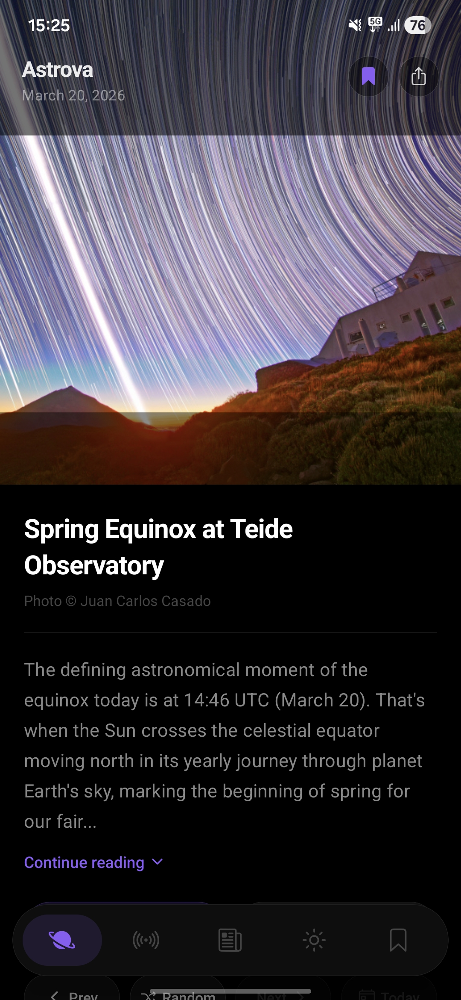
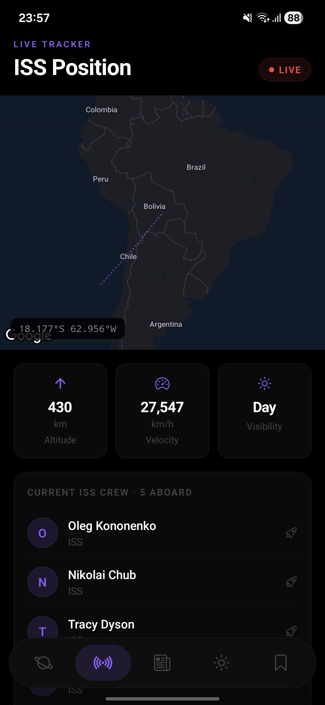
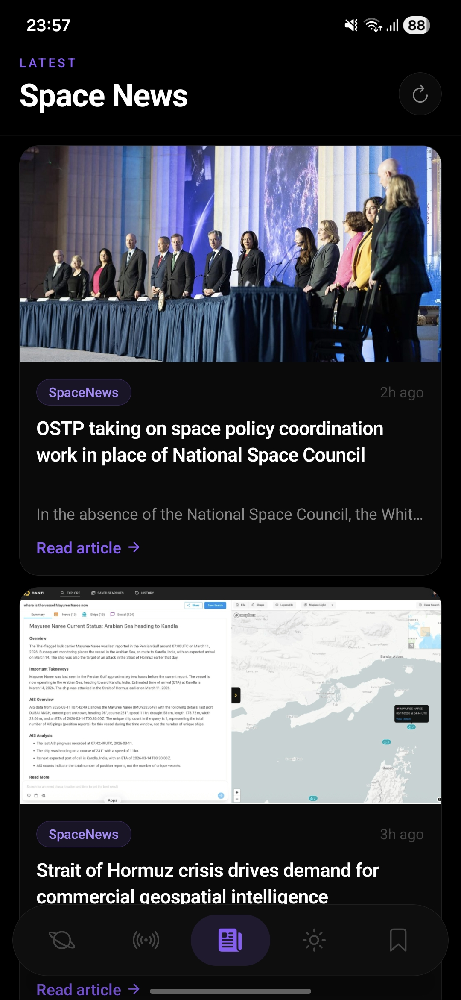
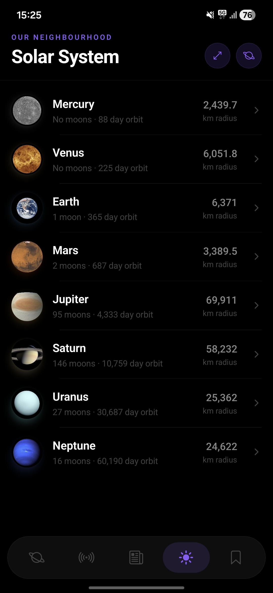
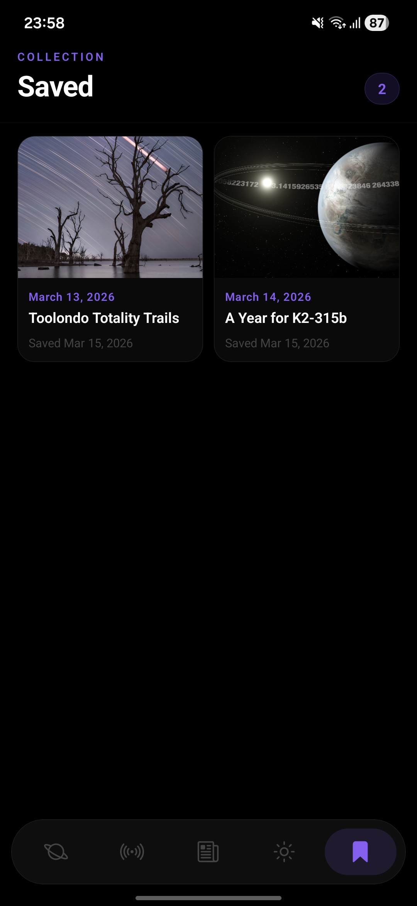

# Astrova

A minimal space exploration app built with React Native and Expo. Browse NASA's Astronomy Picture of the Day, track the ISS in real time, explore the solar system, and read the latest space news.

## Screens

- **Home** - NASA APOD with prev/next/random navigation and save to collection
- **ISS Tracker** - Live ISS position on a dark map, updating every 5 seconds
- **News** - Latest space news via Spaceflight News API
- **Solar System** - All 8 planets with physical and orbital data
- **Saved** - Your bookmarked APOD images, stored locally

## Screenshots







## Stack

- [Expo](https://expo.dev) + [Expo Router](https://expo.github.io/router)
- React Native
- AsyncStorage for local persistence and APOD caching
- NASA APOD API, wheretheiss.at, Spaceflight News API

## Getting Started

```bash
git clone https://github.com/ayush-sharma11/astrova
cd astrova
npm install
```

Create a `.env` file:

```
EXPO_PUBLIC_NASA_KEY=your_nasa_api_key_here
```

Get a free NASA API key at [api.nasa.gov](https://api.nasa.gov).

```bash
npm start
```

## Download

[Download APK](https://github.com/ayush-sharma11/astrova/releases/latest)
